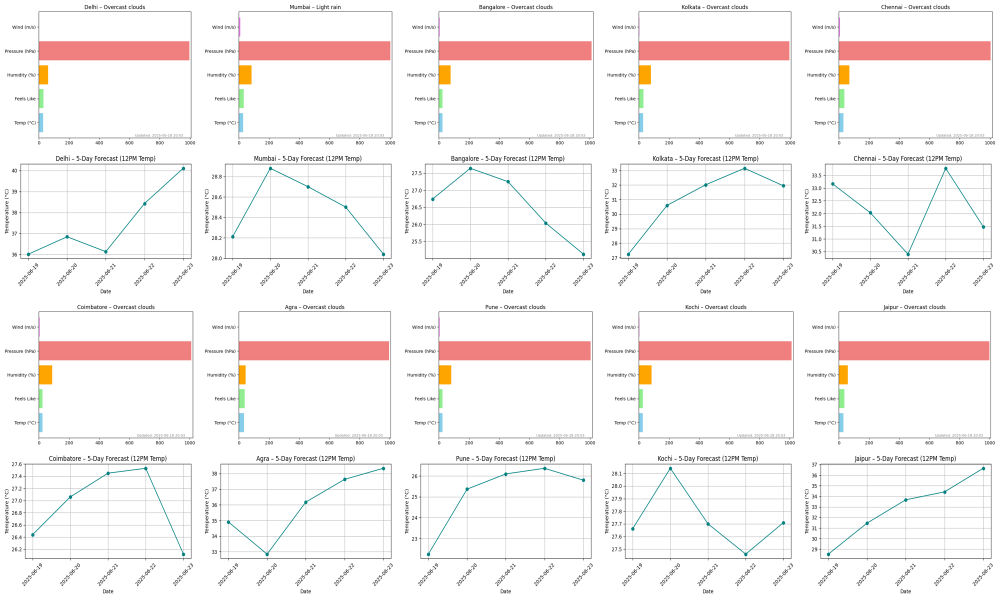
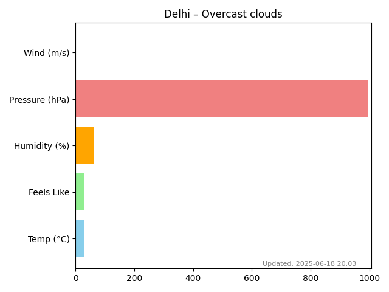

# 🌤️ Weather Dashboard - Flask Web App

This is a Python Flask-based web application that integrates with the **OpenWeatherMap API** to display current weather and 5-day forecasts for multiple Indian cities using interactive visualizations.

---

## 📌 Features

✅ Fetches real-time weather data using API  
✅ Generates bar and line charts using `matplotlib`  
✅ Combined dashboard for all cities  
✅ Individual dashboards with:
- Current weather chart
- 5-day forecast chart  
✅ Clean UI using HTML + CSS  
✅ Download buttons for every chart (PNG format)

---

## 🏙️ Cities Covered
- Delhi
- Mumbai
- Bangalore
- Kolkata
- Chennai

---

## 📷 Screenshots

### 🔹 Combined Dashboard


### 🔹 Sample City Dashboard


---

## 🔧 Tech Stack

- Python 3.x  
- Flask  
- Matplotlib  
- HTML/CSS  
- OpenWeatherMap API

---

## ▶️ How to Run

### 1. Clone the repository

```bash
git clone https://github.com/chrysl7076/weather_dashboard.git
cd weather_dashboard

